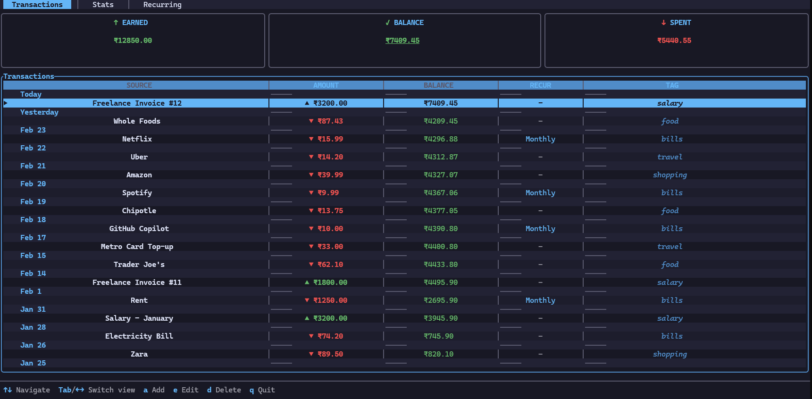
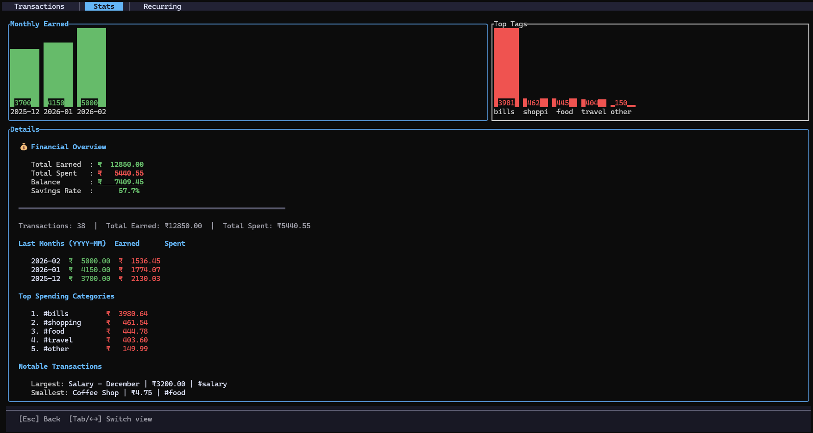

# FiTui

[](https://ratatui.rs/)


A lightweight terminal-based personal finance manager. Record transactions, track spending, and view financial insights, all from your terminal.

**Version:** 0.2.0

---

## Features

- **Transaction Management** – Add, view, and delete credit/debit transactions
- **Smart Stats** – View totals (earned, spent, balance) and spending breakdowns by tag
- **Recurring Transactions** – Auto-insert monthly bills, salary, and subscriptions
- **Local & Private** – SQLite database with configurable tags and currency (YAML)
- **Keyboard-Driven** – Fast, efficient terminal UI

### Screenshots

| Main Interface | Stats View |
|----------------|------------|
|  |  |

---
## Change Log

### v0.2.0
- Added recurring payments management window
- Enhanced recurring transaction handling logic
- Added get_recurring_for_transaction method in App
- Improved recurring entries migration logic to support updated schema
- Modularized UI components (transaction form, header, modal rendering)
- Improved popup rendering and visual separation
- Fixed form field order mismatch to align with navigation logic
- Removed redundant code and improved internal readability
- Added unit tests for form, stats, and model logic
- Added integration tests using in-memory SQLite
- Added migration safety tests


## Installation

### Prerequisites
- [Rust](https://rustup.rs/) installed

### Build
```bash
cargo build --release
```

Binary location: `target/release/fitui` (Windows: `fitui.exe`)

### Install

**Linux / macOS**
```bash
mkdir -p ~/.local/bin
cp target/release/fitui ~/.local/bin/
chmod +x ~/.local/bin/fitui
fitui
```

**Windows**
1. Copy `fitui.exe` to a permanent location (e.g., `C:\Users\<you>\cli\`)
2. Add that folder to your PATH
3. Run `fitui` from any terminal

**Termux (Android)**
```bash
pkg install rust
cargo build --release
cp target/release/fitui ~/.local/bin/
fitui
```
*Note: First build may take 10-15 minutes on mobile devices.*

---

## Configuration

### File Locations

| OS | Database | Config |
|----|----------|--------|
| **Linux** | `~/.local/share/fitui/budget.db` | `~/.config/fitui/config.yaml` |
| **macOS** | `~/Library/Application Support/com.ayan.fitui/budget.db` | `~/Library/Preferences/com.ayan.fitui/config.yaml` |
| **Windows** | `AppData\Roaming\ayan\fitui\data\budget.db` | `AppData\Roaming\ayan\fitui\config\config.yaml` |

*Config file is auto-created on first run.*

### Tags & Currency

Edit `config.yaml` to customize:

```yaml
currency: ₹  # Common symbols: $, €, £, ¥, ₹, ₽, ₩, ฿, ₪

tags:
  - food
  - travel
  - shopping
  - bills
  - salary
  - other
```

---


## Planned Features

### Coming Soon
- **Enhanced Stats Page** – More visualizations, charts, and filtering options
- **CSV Import** – Bulk import transactions from PayPal, GPay, bank statements, and other sources
- **Budget Goals & Alerts** – Set monthly spending limits per tag with notifications
- **Search & Filter** – Find transactions by amount, date range, tag, or description
- **Export Reports** – Generate CSV/PDF reports for tax or accounting purposes
- **Custom Date Ranges** – View stats for specific periods (last week, quarter, year)

### Under Consideration

- **Multi-Currency Support** – Track expenses in different currencies with conversion
- **Transaction Notes** – Add detailed descriptions or memos to entries
- **Split Transactions** – Assign a single expense to multiple tags
- **Data Backup/Sync** – Export/import database for backup or cross-device sync
- **Themes & Colors** – Customizable color schemes for the terminal UI

> Have a feature request? [Open an issue](https://github.com/ayanchavand/fitui/issues) or contribute!

---

## License

MIT